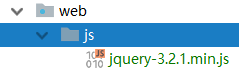

[TOC]

---

# 3. SpringMVC 注解式开发

-   SpringMVC注解式开发:处理器是基于注解的类的开发;对于每一个定义的处理器,无需在配置文件中逐个注册,只需在代码中通过对类与方法的注解,便可完成注册;即注解替换的是配置文件中对于处理器的注册部分
-   注解式开发是重点

## 3.1 第一个注解式开发程序

### 3.1.1 注册组建扫描器

-   组件:即处理器,通过组件扫描器指定处理器所在的基本包

-   通过\<context:component-scan base-package="基本包.*"/>注册

-   ```xml
        <!--注册组件扫描器:组件即处理器-->
        <context:component-scan base-package="com.sqm.annotation.*"/>
  ```

### 3.1.2 定义处理器

-   此时处理器类**无需继承任何父类，实现任何接口**;在类上与方法上添加相应注解即可

-   **@Controller:当前类为处理器**

-   **@RequestMapping:当前方法为处理器方法**

    -   该方法要**对value属性所指定的URL进行处理与响应**,方法名可随意
    -   @RequestMapping("指定的URL")

-   ```java
    @Controller
    public class MyAnnotationController {
        @RequestMapping("/my-annotation-controller.do")
        public ModelAndView doSome(HttpServletRequest request, HttpServletResponse response) throws Exception{
            ModelAndView modelAndView = new ModelAndView();
            modelAndView.addObject("p", "annotation controller");
            modelAndView.setViewName("view");
            return modelAndView;
        }
    }
    ```

-   当然,**value可以是URL数组**,`{"/1.do","/2.do","/3.do",...}`多个URL请求路径可以匹配一个处理器

-   ```java
    @Controller
    public class MyAnnotationController {
        @RequestMapping({"/my-annotation-controller.do","/my-controller.do"})
    ```

## 3.2 处理器的请求映射规则的定义

-   通过**@RequestMapping** 注解可以**定义处理器对于请求的映射规则**。该注解可以**注解在方法上，也可以注解在类上**，但**意义不同**

### 3.2.1 对请求URI的命名空间的定义

-   一个@Controller 所注解的类中，可以定义多个处理器方法。当然，不同的处理器方法所匹配的 URI
    是不同的,通过@RequestMapping指定不同的URI

-   但是当这些方法的请求路径有相同的URI部分,可以被抽取到**注解在类上的@RequestMapping**的value属性中,此时的这个 URI 称为**命名空间**

-   换个角度说，**要访问处理器的指定方法，必须要在方法指定 URI 之前加上处理器类前定义的命名空间**

-   ```java
    @Controller
    @RequestMapping("/test")
    public class MyAnnotationController {
        @RequestMapping("/my-annotation-controller.do")
        public ModelAndView doSome(HttpServletRequest request, HttpServletResponse response) throws Exception{
            return ...
        }
        @RequestMapping("/my-controller.do")
        public ModelAndView doOther(HttpServletRequest request, HttpServletResponse response) throws Exception{
            return ...
        }
    }
    ```

-   ```jsp
    <a href="${pageContext.request.contextPath}/test/my-controller.do">controller</a><br/>
    <a href="${pageContext.request.contextPath}/test/my-annotation-controller.do">annotation-controller</a><br/>
    ```

### 3.2.2 请求URI中通配符的应用

-   在处理器方法所映射的 URI中，可以使用通配符，有两种用法

1.  资源名称中使用通配符

    -   **在请求的资源名称中使用通配符**，表示请求的资源名称中只要包含指定的字符即可完成匹配

    -   下面的写法中/some\*.do 表示的意思是，只要请求的资源名称以 some 开头即可；/*other.do表示的意思是，只要请求的资源名称以 other结尾即可

    -   ```java
        @Controller
        @RequestMapping("/test")
        public class MyAnnotationController2 extends MyAnnotationController {
            @Override
            @RequestMapping("some*.do")
            public ModelAndView doSome(HttpServletRequest request, HttpServletResponse response) throws Exception {
                return new ModelAndView("some");
            }

            @Override
            @RequestMapping("*other.do")
            public ModelAndView doOther(HttpServletRequest request, HttpServletResponse response) throws Exception {
                return new ModelAndView("other");
            }
        }
        ```

2.  资源路径中使用通配符

    -   在资源路径中使用通配符，有两种用法：路径级数的**精确**匹配，与路径级数的**可变**匹配

    -   `/xxx/*/show.do`：表示在 show.do 的资源名称前面，**只能有两级路径**，第一级必须是/xxx，而第二级随意。这种称为路径级数的精确匹配

    -   `/xxx/**/show.do`：表示在 show.do 的资源名称前面，**必须以/xxx 路径开头**，而其它级的路径是否包含，若包含又包含几级，各级又叫什么名称，均随意。这种称为路径级数的可变匹配

    -   ```java
        @Controller
        @RequestMapping("/test")
        public class MyAnnotationController2 extends MyAnnotationController {
            @Override
            @RequestMapping("/some/*/some*.do")
            public ModelAndView doSome(HttpServletRequest request, HttpServletResponse response) throws Exception {
                return new ModelAndView("some");
            }

            @Override
            @RequestMapping("/other/**/*other.do")
            public ModelAndView doOther(HttpServletRequest request, HttpServletResponse response) throws Exception {
                return new ModelAndView("other");
            }
        }
        ```

    -   ```jsp
         <a href="${pageContext.request.contextPath}/test/some/1/some-what-ever.do">some</a><br/>
         <a href="${pageContext.request.contextPath}/test/other/what-ever-other.do">other</a><br/>
         ```
        ​```

### 3.2.3 对请求提交方式的定义

-   @RequestMapping中有一个属性method,用于限制被注解的方法所处理的请求的提交方法

    -   method取值范围为RequestMethod枚举常量;**RequestMethod.GET 与RequestMethod.POST**

    -   ```java
        @RequestMapping(value="/register.do",method=RequestMethod.POST)
        ```

    -   再写一次客户端常用的请求方式及其对应的提交方式

    -   | 序号   | 请求方式        | 提交方式         |
        | ---- | ----------- | ------------ |
        | 1    | 表单请求        | 默认GET,可以POST |
        | 2    | AJAX请求      | 默认GET,可以POST |
        | 3    | 地址栏请求       | GET          |
        | 4    | 超链接请求       | GET          |
        | 5    | src属性资源路径请求 | GET          |

-   若指定了处理器方法匹配的请求提交方式为 POST，则相当于指定了请求发送的方式：要么使用表单请求，要么使用 AJAX 请求

### 3.2.4 对请求中携带参数的定义

-   @RequestMapping中**params属性**中定义了**请求中**必须携带的**参数**的要求

-   ```java
    @RequestMapping(value="/xxx.do",params={"name","age"})
             要求请求中必须携带请求参数 name 与 age
    @RequestMapping(value="/xxx.do",params={"!name","age"})
             要求请求中必须携带请求参数 age ,必须不能携带name 
    @RequestMapping(value="/xxx.do",params={"name=sqm","age=23"})
             要求请求中必须携带请求参数 name,其值必须为sqm;必须携带参数age,其值必须为23
    @RequestMapping(value="/xxx.do",params="name!=sqm")
             要求请求中必须携带请求参数 name,其值必须不能为为sqm        
    ```

## 3.3. 处理器方法的参数

-   处理器方法可以包含以下五类参数，这些参数会在系统调用时由系统自动赋值
    1.  **HttpServletRequest**
    2.  **HttpServletResponse**
    3.  **HttpSession**
    4.  **用于承载数据的Model**
    5.  **请求中所携带的请求参数**(如form中的参数)

### 3.3.1 请求中的参数逐个接收

-   举例讲解一下第五类参数： 请求中所携带的请求参数。即处理器方法是如何接收请求参数的

1.  修改index页面

    ```jsp
       <form action="${pageContext.request.contextPath}/test/regist.do" method="post">
           <table>
               <tr>
                   <td>用户名</td>
                   <td><input type="text" name="username" id="username"></td>
               </tr>
               <tr>
                   <td>密码</td>
                   <td><input type="password" name="password" id="password"></td>
               </tr>
               <tr>
                   <td><input type="submit" value="注册"></td>
               </tr>
           </table>
       </form>
    ```

2.  修改处理器类MyController

    ```java
    @Controller
    @RequestMapping(value = "/test")
    public class RegistController {
        @RequestMapping(value = "/regist.do", method = RequestMethod.POST)
        //保证请求中的参数顺序与参数name与处理器处理方法的参数列表的参数顺序与参数名一致
        public ModelAndView regist(String username, String password) throws Exception{
            ModelAndView modelAndView = new ModelAndView();
            modelAndView.addObject("myusername", username);
            modelAndView.addObject("mypassword", password);
            modelAndView.setViewName("regist");
            return modelAndView;
        }
    }
    ```

3.  views.xml中注册regist的view

    ```xml
        <bean class="org.springframework.web.servlet.view.InternalResourceView" id="regist">
            <property name="url" value="/web-resources/regist.jsp"/>
        </bean>
    ```

4.  添加regist页面

    ```jsp
    <body>
    用户名:${myusername}
    密码${mypassoword}
    </body>
    ```

### 3.3.2 请求参数中文乱码的问题

-   对于前面所接收的请求参数，若含有中文，则会出现中文乱码问题
-   spring中专门的字符集过滤器可以解决中文乱码问题org.springframework.web.filter包下**CharacterEncodingFilter**类

1.  解决方案

    -   在 **web.xml** 中**注册字符集过滤器**，即可解决 Spring 的请求参数的中文乱码问题

        -   最好将该过滤器**注册在其它过滤器之前**
        -   过滤器的执行是按照其注册顺序进行的

    -   ```xml
            <!--注册字符集过滤器-->
            <filter>
                <filter-name>characterEncodingFilter</filter-name>
                <filter-class>org.springframework.web.filter.CharacterEncodingFilter</filter-class>
                <!--指定字符集-->
                <init-param>
                    <param-name>encoding</param-name>
                    <param-value>UTF-8</param-value>
                </init-param>
                <!--指定强制使用字符集-->
                <init-param>
                    <param-name>forceEncoding</param-name>
                    <param-value>true</param-value>
                </init-param>
            </filter>
            <!--映射到所有url-->
            <filter-mapping>
                <filter-name>characterEncodingFilter</filter-name>
                <url-pattern>/*</url-pattern>
            </filter-mapping>
      ```

2.  源码分析

    -   打开 CharacterEncodingFilter 类的源码，发现有两个 set 属性：encoding 与 forceEncoding

    -   encoding：String 类型，指定字符集

    -   forceEncoding：boolean 类型，指定是否强制使用指定的字符集

        -   若为 true，则代码中指定的字符集将不起作用,使用encoding指定的字符集
        -   若为 false，则代码中若指定了字符集，就使用代码指定字符集
        -   若代码中没有指定字符集，则使用encoding指定的字符集

    -   ```java
         @Override
         	protected void doFilterInternal(
         			HttpServletRequest request, HttpServletResponse response, FilterChain filterChain)
         			throws ServletException, IOException {

         		String encoding = getEncoding();
         		if (encoding != null) {
         			if (isForceRequestEncoding() || request.getCharacterEncoding() == null) {
         				request.setCharacterEncoding(encoding);
         			}
         			if (isForceResponseEncoding()) {
         				response.setCharacterEncoding(encoding);
         			}
         		}
         		filterChain.doFilter(request, response);
         	}
         ```
        ​```

        -   若使用 encoding 指定了字符集，则一定使用该字符集的条件有两个：要么 forceEncoding 为 true，要么代码中没有指定字符集

### 3.3.3 校正请求参数名@RequestParam

-   校正请求参数名:若**请求 URL** 所携带的参数名称与**处理方法**中指定的参数名**不相同**时,则需在**处理方法参数前**，添加一个注解**@RequestParam(“请求参数名”)**
-   @RequestParam()有三个属性:
    1.  value:指定请求参数的名称
    2.  required:指定该注解所修饰的参数是否是必须的，boolean 类型。若为 true，则表示请求中所携带的参数中必须包含当前参数。若为 false，则表示有没有均可
    3.  defaultValue:制定当前参数的默认值;若请求 URI 中没有给出当前参数，则当前方法参数将取该默认值。即使 required 为 true，且 URI 中没有给出当前参数，该处理器方法参数会自动取该默认值，而不会报错

1.  修改index页面:将表单中的参数名称修改的与原来不一样

2.  修改处理器类MyController

    ```java
    @Controller
    @RequestMapping(value = "/test")
    public class RegistController {
        @RequestMapping(value = "/regist.do", method = RequestMethod.POST)
        //保证请求中的参数顺序与参数name与处理器处理方法的参数列表的参数顺序与参数名一致
        public ModelAndView regist(@RequestParam(value = "myusername", required = true, defaultValue = "默认用户名") String username, @RequestParam(value = "mypassword", required = true, defaultValue = "默认密码") String password) throws Exception {
            ModelAndView modelAndView = new ModelAndView();
            modelAndView.addObject("myusername", username);
            modelAndView.addObject("mypassword", password);
            modelAndView.setViewName("regist");
            return modelAndView;
        }
    }
    ```

### 3.3.4 整体参数接收

-   将处理器方法的参数定义为一个对象,只需保证**请求参数名与这个对象的属性同名即可**

1.  定义VO类Student(*Value objects*)

    ```java
    public class User{
    	private String myusername;
    	private String mypassword;
    	//getter and setter
    	//toString()
    }
    ```

2.  修改处理器类MyController

    ```java
    @Controller
    public class UserController {
        @RequestMapping("/regist.do")
        public ModelAndView regist(User user) throws Exception {
            ModelAndView modelAndView = new ModelAndView();
            modelAndView.addObject("myUser", user);
            modelAndView.setViewName("regist");
            return modelAndView;
        }
    }
    ```

3.  修改regist页面

    ```jsp
    <body>
    用户:${myUser}<br/>
    用户名:${myUser.myusername}<br/>
    密码${myUser.mypassword}  <br/>
    </body>
    ```

### 3.3.5 域属性参数的接收

-   域属性:**对象属性**,**把一个自定义对象作为另一个自定义对象的属性**(如Student的属性School);当**请求参数**中的数据为某类**对象域属性的属性值**时，要求请求参数名为“**域属性名.属性**”

1.  定义VO类

    ```java
    public class UserInformation{
    	private String name;
    	private int age;
    	//getter and setter
    	//toString()
    }

    //修改User类
    public class User{
    	private String myusername;
    	private String mypassword;
      	private UserInformation userInformation;
    	//getter and setter
    	//toString()
    }
    ```

2.  修改index页面

    ```jsp
      <form action="${pageContext.request.contextPath}/regist.do" method="post">
          <table>
              <tr>
                  <td>用户名</td>
                  <td><input type="text" name="myusername"></td>
              </tr>
              <tr>
                  <td>密码</td>
                  <td><input type="password" name="mypassword"></td>
              </tr>
              <tr>
                  <td>真实姓名</td>
                  <td><input type="text" name="userInformation.name"></td>
              </tr>
              <tr>
                  <td>年龄</td>
                  <td><input type="text" name="userInformation.age"></td>
              </tr>
              <tr>
                  <td><input type="submit" value="注册User"></td>
              </tr>
          </table>
      </form>
    ```

3.  修改regist页面

    ```jsp
    <body>
    用户:${myUser}<br/>
    用户名:${myUser.myusername}<br/>
    密码:${myUser.mypassword}  <br/>
    信息:${myUser.userInformation}<br/>
    真实姓名:${myUser.userInformation.name}<br/>
    年龄:${myUser.userInformation.age}  <br/>
    </body>
    ```

### 3.3.6 路径变量@PathVariable

-   路径变量:请求的 **URI 中所携带的变量**;URI可以是变量,如/{name}/{age}/register.do

-   处理器方法中接收的请求参数,可以是请求中携带的参数,也可以式路径变量

-   此时处理器方法中的参数要通过@PathVariable注解

    -   @PathVariable的value值为URI变量名,若路径变量名与参数名相同可不写value

    -   ```java
            @RequestMapping("/{pname}/{age}/regist.do")
            public ModelAndView regist(@PathVariable("pname")String name,@PathVariable int age) throws Exception {
      ```

1.  修改index页面

    ```jsp
      <a href="${pageContext.request.contextPath}/sqm/25/regist.do">pathVariable</a><br/>
    ```

2.  修改处理器PathController

    ```java
    @Controller
    public class PathController {
        @RequestMapping("/{pname}/{age}/regist.do")
        public ModelAndView regist(@PathVariable("pname")String name,@PathVariable int age) throws Exception {
            ModelAndView modelAndView = new ModelAndView();
            modelAndView.addObject("myname", name);
            modelAndView.addObject("myage", age);
            modelAndView.setViewName("regist");
            return modelAndView;
        }
    }
    ```

3.  修改regist页面

    ```jsp
    <body>
    姓名:${myname}<br/>
    年龄:${myage}<br/>
    </body>
    ```

## 3.4 处理器方法的返回值

-   处理器的处理方法通常有四种返回值类型:
    1.  ModelAndView
    2.  String
    3.  无返回值void
    4.  返回自定义类型对象

### 3.4.1 返回 ModelAndView

-   当处理器方法处理完后，**需要跳转**到其它资源，且又要在跳转的资源间**传递数据**
-   若处理器方法仅仅跳转资源而不传递数据,或者传递数据而不跳转(如对页面的Ajax异步响应),要么Model多余,要么View多余,则不适合返回ModelAndView

### 3.4.2 返回 String

-   返回String用于指定逻辑视图名,通过视图解析器将其转换为URL地址

1.  返回内部资源逻辑视图名

    -   返回到内部的view,通过视图解析器解析返回的字符串,与内部资源来映射

    -   修改处理器:携带user参数

    -   ```java
        @Controller
        public class ReturnController {
            @RequestMapping(value = "/return-string.do",method = RequestMethod.POST)
            public String returnString(HttpServletRequest request, User user) throws Exception {
                request.setAttribute("myUser", user);
                return "string";
            }
        }
        ```

    -   修改viewSolver:注册对应"string'的内部资源,或者通过InternalResourceViewResolver拼接前后缀(prefix,suffix)

    -   ```xml
            <bean class="org.springframework.web.servlet.view.InternalResourceView" id="string">
                <property name="url" value="/web-resources/string.jsp"/>
            </bean>
      ```

    -   修改index:提交post表单,携带name值为user参数与userInformation的参数

    -   ```jsp
         <form action="${pageContext.request.contextPath}/return-string.do" method="post">
             <table>
                 <tr>
                     <td>用户名</td>
                     <td><input type="text" name="myusername"></td>
                 </tr>
                 <tr>
                     <td>密码</td>
                     <td><input type="password" name="mypassword"></td>
                 </tr>
                 <tr>
                     <td>真实姓名</td>
                     <td><input type="text" name="userInformation.name"></td>
                 </tr>
                 <tr>
                     <td>年龄</td>
                     <td><input type="text" name="userInformation.age"></td>
                 </tr>
                 <tr>
                     <td><input type="submit" value="returnString"></td>
                 </tr>
             </table>
         </form>
         ```
        ​```

    -   修改string.jsp

    -   ```jsp
        <body>
        ${myUser.myusername} <br/>
        ${myUser.mypassword}  <br/>
        ${myUser.userInformation.name}   <br/>
        ${myUser.userInformation.age}   <br/>
        </body>
        ```

2.  返回 View 对象名

    -   当跳转外部资源时,使用BeanNameViewResolver或者XmlViewResolver,再注册外部资源的view对象bean,即可跳转外部资源

    -   修改配置文件:将url修改为外部资源

    -   修改处理器:直接return String; 无需携带数据

    -   ```java
        @Controller
        public class ReturnController {
            @RequestMapping(value = "/return-string.do",method = RequestMethod.POST)
            public String returnString() throws Exception {
                return "bing";
            }
        }
        ```

### 3.4.3 返回 void

-   返回void的应用场景主要有两种:

    1.  通过 ServletAPI 传递数据并完成跳转

        1.  通过在处理器**方法的参数**中放入的 **ServletAPI 参数**，来完成资源跳转时所要传递的**数据及跳转**。

            1.  可在方法参数中放入 HttpServlet**Request** 或 Http**Session**，使方法中可以直接将数据放入到 **request、session 的域**中，也可通过 request.**getServletContext()**获取到 **ServletContext**，从而将数据放入到 application 的域中
            2.  可在方法参数中放入 HttpServlet**Request** 与 HttpServlet**Response**，使方法可以完成**请求转发与重定向**。注意，**重定向是无法完成对/WEB-INF/下资源的访问的**。

        2.  测试方法:

            1.  修改处理器:无需配置view页面

                ```java
                    //请求转发,携带request,response与vo对象
                    @RequestMapping("/return-void.do")
                    public void returnVoid(HttpServletRequest request, HttpServletResponse response,User user) throws Exception {
                        request.setAttribute("myUser",user);
                        request.getRequestDispatcher("/web-resources/void.jsp").forward(request, response);
                    }
                ```

            2.  修改index

                ```jsp
                  <form action="${pageContext.request.contextPath}/return-void.do" method="post">
                	...
                ```

    2.  AJAX响应

        -   无需跳转到任何资源,而是对于Ajax的异步请求的响应

        1.  导入jar包

            -   服务端向浏览器传回的是json(JavaScript Object Notation)数据,需要使用一个工具类将**字符串包装为 JSON 格式**,导入json的包

            -   maven中的dependency;一定要加`<classifier>jdk15</classifier>`标签

            -   ```xml
                       <dependency>
                           <groupId>net.sf.json-lib</groupId>
                           <artifactId>json-lib</artifactId>
                           <version>2.4</version>
                           <classifier>jdk15</classifier>
                       </dependency>
                 ```
            ​

        2.  引入jQuery库

            -   使用jQuery的ajax()方法提交Ajax请求,引入jQuery的库

            -   在webapp目录下(即web应用程序模块),新建js文件夹,将jquery-x.x.x.js放入其中

            -   

            -   要使用此jQuery库文件,需要**在使用ajax()方法的页面中引入script**

            -   ```jsp
                 <head>
                   <title>$Title$</title>
                     <script type="text/javascript" src="${pageContext.request.contextPath}/js/jquery-3.2.1.min.js"></script>
                 </head>
                 ```

        3.  定义index页面

            -   页面要有两部分

            -   一个是\<button/>用于提交ajax请求(或者是任何id的可提交的标签,如\<a/>),

            -   另一个是自定义的\<script/>,用于处理ajax请求

            -   ```jsp
                      <script type="text/javascript">
                          $(function () {
                              $("button").onclick(function () {
                                  $.ajax({
                                      url: "${pageContext.request.contextPath}/my-ajax.do",
                                      data: {
                                          myusername: "sqm",
                                          mypassword: "win",
                                          name:"song",
                                          age: 23
                                      },
                                      success: function (data) {
                                          var myJson = JSON.parse(data);
                                          alert(myJson.myusername+" "+myJson.mypassword + " "+myJson.name + " " + myJson.age);
                                      }
                                  });
                              });
                          });
                      </script>
                ```

        4.  修改处理器类MyController

            -   ```java
                @Controller
                public class AjaxController {
                    //处理器接收ajax请求的参数,可以逐个接收也可以以对象的方式整体接收
                    @RequestMapping("/my-ajax.do")
                    public void doAjax(HttpServletResponse response, User user) throws Exception {
                        //将数据存放到map中
                        Map<String, Object> map = new HashMap<>();
                        map.put("myusername", user.getMyusername());
                        map.put("mypassword", user.getMypassword());
                        map.put("name", user.getUserInformation().getName());
                        map.put("age", user.getUserInformation().getAge());
                        //将map转换为JSON,JSON转为字符串
                        JSONObject myJson = JSONObject.fromObject(map);
                        String jsonString = myJson.toString();
                        //将数据发回客户端
                        response.setCharacterEncoding("utf-8");
                        PrintWriter printWriter = response.getWriter();
                        printWriter.print(jsonString);
                        printWriter.close();
                    }
                }
                ```

### 3.4.4 返回 Object

-   处理器方法也可以返回 Object 对象,但是返回的Object对象是作为**直接在页面显示的数据**出现,而不是逻辑视图view
-   返回Object,需要使用**@ResponseBody注解**,将转换后的JSON数据放入到响应体response中

1.  环境搭建
    1.  导入jar包

        -   返回Object数据,是**将数据转化为JSON对象**后传递给浏览器页面

        -   将Object转换为JSON是由jackson工具完成,需要导入jackson的相关jar包

        -   jackson-annotations

        -   jackson-core

        -   jackson-databind

        -   maven中的配置

        -   ```xml
            <dependency>
                <groupId>com.fasterxml.jackson.core</groupId>
                <artifactId>jackson-annotations</artifactId>
                <version>2.9.3</version>
            </dependency>
            <dependency>
                <groupId>com.fasterxml.jackson.core</groupId>
                <artifactId>jackson-core</artifactId>
                <version>2.9.3</version>
            </dependency>
            <dependency>
                <groupId>com.fasterxml.jackson.core</groupId>
                <artifactId>jackson-databind</artifactId>
                <version>2.9.3</version>
            </dependency>
            ```

    2.  注册注解驱动

        -   将Object转换为JSON需要由**Http消息转换器HttpMessageConverter**完成
        -   当Spring容器初始化时,通过`<mvc:annotation-driven/>`创建注解驱动的时候,默认创建了七个HttpMessageConverter对象
2.  返回数值类型对象
    1.  修改index页面

        按下button后alert出数据data

        ```jsp
        	<script type="text/javascript" src="${pageContext.request.contextPath}/js/jquery-3.2.1.min.js"></script>
        	<script type="text/javascript">
                  $(function () {
                      $("button").click(function () {
                          $.ajax({
                              url: "${pageContext.request.contextPath}/return-number.do",
                              success: function (data) {
                                  alert(data);
                              }
                          });
                      });
                  });
        	</script>
        ```

    2.  修改处理器

        在处理器的方法上添加@ResponseBody注解,将数据放入响应体

        ```java
            //返回Object
            @RequestMapping("/return-object.do")
            @ResponseBody
            public Object returnObject() {
                return 123.456;
            }
        ```

    3.  修改配置文件

        注册mvc-annotation

        ```xml
            <!--注册mvc的注解驱动-->
            <mvc:annotation-driven/>
        ```
3.  返回字符串对象
4.  返回自定义类型对象
    1.  定义VO类
    2.  修改处理器
    3.  修改index
5.  返回Map集合
    1.  修改处理器
    2.  修改index
6.  返回List集合
    1.  修改处理器
    2.  修改index

